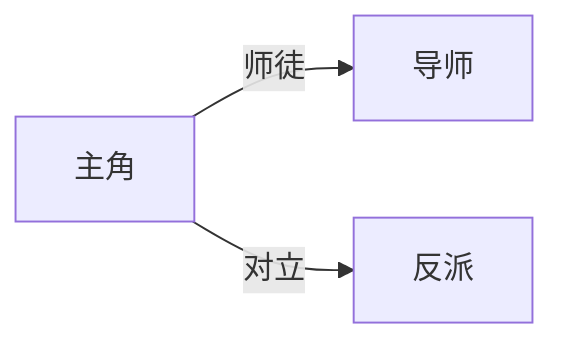

# 任务：生成关系网

请根据角色与世界观文件，撰写**人物关系网**，保存到 `04_relationships.md`。

## 输出结构

```markdown
# 关系网

## 关系总览图
（用 Mermaid graph 绘制核心人物关系，标注关系类型：血缘/利益/情感/对立）

## 核心关系详解

### [角色A] — [角色B]
- **关系性质**：
- **当前状态**（故事开始前）：
- **演变方向**：（计划变化与大概章段）
- **关键场景**：（计划中的关系转折点）

## 阵营与站队
| 阵营 | 成员 | 对外关系 | 内部矛盾 |
|------|------|----------|----------|

## 隐藏关系与秘密
| 关系 | 真实情况 | 读者/角色谁知道 | 计划揭露章 |
|------|----------|-----------------|------------|

## 关系驱动的冲突清单
（按优先级排列，供大纲使用）
```

## Mermaid 示例



## 同时输出摘要

使用独立 FILE 块输出 `meta/summaries/relationships_summary.md`，**不超过 400 字**。
