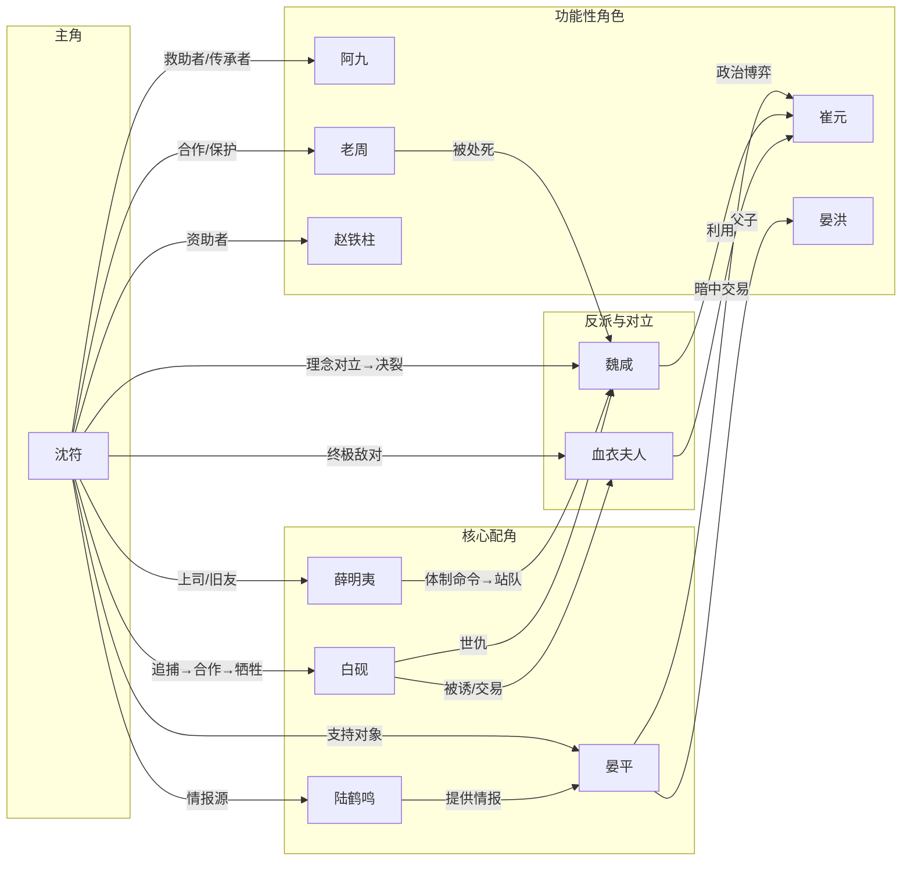

<!-- 本文件基于 02_characters.md 与 03_worldview.md 生成，覆盖核心角色共12人。关系定义为故事开始前（风吟历 822 年冬）状态，演变与关键场景依据剧情计划标注章段。 -->

# 关系网

## 关系总览图

## 核心关系详解

### 沈符 — 魏咸
- **关系性质**：上下级之下的理念死敌。沈符为符律司录事，魏咸为司正。
- **当前状态（故事开始前）**：魏咸对沈符抱有直觉警惕，但沈符严守正道、业绩优异，魏咸无公开把柄。二人维持表面尊重。
- **演变方向**：ch003 在符斗裁判中首次公开冲突，沈符被迫动用半个黑符；ch006 魏咸处死老周以警告沈符；ch008 魏咸引动帝都符阵欲与沈符同归于尽，失败后自焚。
- **关键场景**：ch003 符斗擂台（沈符露馅）、ch006 符律司内廷对峙（老周之死）、ch008 帝都符阵决战。

### 沈符 — 白砚
- **关系性质**：追捕者与逃亡者，后转为共生合作关系。
- **当前状态（故事开始前）**：沈符奉魏咸之令追捕白砚长达两年，白砚恨沈符入骨。二人有过三次近距离交锋，白砚皆逃脱。
- **演变方向**：ch003 在黑水巷短兵相接，白砚设伏陷害沈符；ch006 在碧潮州被迫联手应对血衣教追杀，建立信任；ch008 白砚为救沈符而断臂（代价之一）；ch010 用血符封印源脉裂口，牺牲。
- **关键场景**：ch003 黑水巷陷阱、ch006 碧潮州货船密室谈话、ch008 碎雪原临时联手、ch010 封印台。

### 沈符 — 薛明夷
- **关系性质**：职场上司兼旧友，存在信任，但薛明夷的纪律本位与沈符的非常手段间有张力。
- **当前状态**：私交良好（常一同巡夜、喝茶），但薛明夷不知沈符接触禁术。她收藏孟寒江遗信未上交，对沈符有保护欲。
- **演变方向**：ch005 薛明夷在血衣教袭击现场目睹沈符动用黑符，震怒但未检举；ch007 在晏平政变当日选择站队沈符，违抗魏咸调令；ch009 为掩护沈符与血衣夫人正面交锋，重伤。
- **关键场景**：ch005 小巷废墟对峙、ch007 符律司内廷选择、ch009 碎雪原入口断后。

### 沈符 — 陆鹤鸣
- **关系性质**：单向情报供给者，陆鹤鸣主动接近沈符；后期变为合作盟友。
- **当前状态**：二人仅有两面之缘（符律司联谊茶会），陆鹤鸣已私下搜集沈符的作品档案，确信他是唯一能理解天裂的人。
- **演变方向**：ch002 陆鹤鸣以“灾异咨询”为名约见沈符，出示源脉衰减曲线；ch004 提供禁术图谱比对结果；ch009 在司天监以自身引动裂空符引发天裂示警，身亡。
- **关键场景**：ch002 碧落山观星台初次深谈、ch004 密室数据移交、ch009 司天监天台自焚。

### 晏平 — 崔元
- **关系性质**：政权继承人与门阀巨头之间的政治角力。崔元欲将晏平变为傀儡，晏平欲摆脱控制。
- **当前状态**：晏平表面尊敬崔元，暗中已通过太傅府旧部搜集崔元通敌（血衣教走私朱砂）证据。
- **演变方向**：ch004 崔元设宴拉拢，晏平隐忍周旋；ch007 在沈符和薛明夷的协助下发动政变，软禁崔元及谢氏家主；ch008 晏平登基后面对门阀反扑。
- **关键场景**：ch004 雍王府夜宴、ch007 午夜宫变。

### 白砚 — 魏咸
- **关系性质**：世仇。魏咸下令处死白砚之父并烙其面。
- **当前状态**：白砚一切行为的底层动机皆为复仇，他在黑水巷多次设计暗杀魏咸未果。
- **演变方向**：ch003 回忆揭示父仇；ch006 白砚利用血衣教情报构陷魏咸通敌（实为崔元通敌，白砚借刀杀人）；ch008 魏咸死时白砚在场，魏咸至死不知白砚名字。
- **关键场景**：ch003 黑水巷回忆段落、ch006 碧潮州信函伪造。

### 血衣夫人 — 白砚
- **关系性质**：诱惑者与潜在棋子。血衣夫人知白砚仇恨魏咸与世家，欲拉其入教。
- **当前状态**：白砚拒绝三次，但在 ch006 碧潮州接触后改变了态度（血衣夫人以父亲残谱完整版为交换）。
- **演变方向**：ch006 正式交易，白砚获得「源脉锁」完整图谱；ch008 白砚醒悟血衣夫人意在利用他完成裂空符，转而投靠沈符；ch009 决战时白砚用所学血符帮助沈符延缓仪式。
- **关键场景**：ch006 碧潮州地下密室交易、ch008 碎雪原临时反水。

### 沈符 — 阿九
- **关系性质**：施救者与被救者，逐渐发展为师徒式传承。
- **当前状态**：ch001 沈符在天垣城东市从符斗余波中救下阿九，将之安置在符律司下房打杂。阿九感激却怕被发现。
- **演变方向**：ch002 起阿九成为沈符的秘密传令员（往黑市送信、探听消息）；ch007 阿九在政变中传递关键情报；ch010 沈符临终前将最后一道符法刻在阿九背上，遗言“符可烧尽，道不可绝”。
- **关键场景**：ch001 街头救援、ch007 宫变传令、ch010 符刻传承。

## 阵营与站队

| 阵营 | 成员 | 对外关系 | 内部矛盾 |
|------|------|----------|----------|
| **正统秩序**（符律司） | 魏咸（领导者）、大部分底层符师 | 与黑市/血衣教敌对，与皇室呈服从中博弈，与门阀暗中勾结（魏咸利用崔元） | 魏咸极端保守 vs 薛明夷务实派；老周等贱籍符匠被压迫 |
| **皇室改革派** | 晏平（核心）、太傅府旧部 | 与符律司博弈，与门阀对立（减税、收兵权），与血衣教未直接接触 | 晏平理想主义 vs 旧部求稳 vs 晏洪昏聩拖累 |
| **门阀** | 崔元（中州）、谢氏（江北）等 | 与皇室暗中对抗，与血衣教有资源交易（朱砂/符石），与符律司互相利用 | 崔元与谢氏争主导权；族内少壮派想投靠晏平 |
| **血衣教** | 血衣夫人（教主）、海外信众 | 与正统秩序敌对，与门阀私下交易，与黑市符师既拉拢又算计 | 狂信徒与被胁迫者之间对立；真相派试图逃亡（ch006案例） |
| **黑市符师** | 白砚（自由）、赵铁柱（海外联络） | 与符律司敌对，与血衣教复杂（部分合作），与皇室无直接联系 | 独行派（白砚）vs 受雇于门阀的组派 |

## 隐藏关系与秘密

| 关系 | 真实情况 | 读者/角色谁知道 | 计划揭露章 |
|------|----------|-----------------|-----------|
| 沈符使用黑符的记忆被抹去 | 他在封印孟寒江时曾动用半道黑符，血衣夫人通过忘川符抹去此段记忆 | 血衣夫人知；沈符本人不知；读者前期不知 | ch008 记忆恢复 |
| 薛明夷收藏孟寒江遗信 | 孟寒江堕落前写给沈符的道歉信，其中提到“我走的路，你终会走” | 薛明夷独知；沈符及读者后期才知 | ch005 薛明夷对话提及；ch007 信全文揭露 |
| 陆鹤鸣一直在隐瞒真实身份 | 他是前朝符阵研究所后人，暗中保留研究所部分禁术记载 | 陆鹤鸣独知；无第二人知晓 | ch009 牺牲前告白 |
| 白砚的血符残谱中缺了最关键一页 | 血衣夫人撕走并私藏了“源脉锁”逆转方法（实为裂空符引导术），白砚交换的仍是假全本 | 血衣夫人知；白砚、沈符一直不知 | ch008 决战前揭露 |
| 崔元与血衣教交易内容超出朱砂 | 崔元为血衣夫人提供帝都护城符阵路线图（为 ch008 符阵被侵入埋下伏笔） | 崔元与血衣夫人知；其他人未知 | ch007 政变后审讯揭露 |
| 孟寒江被封印后并非死亡 | 他只是被锁于碎雪源地底冰窟，血衣夫人已将他唤醒，作为ch009打手 | 血衣夫人知；沈符不知 | ch009 碎雪原重逢 |

## 关系驱动的冲突清单

（按优先级排列，供大纲使用）

1. **魏咸 vs 沈符**（核心对立，贯穿卷一至卷三）。魏咸以禁术为由施压沈符，ch003 符斗裁判、ch006 处死老周、ch008 帝都符阵同归于尽，层层升级。优先级：★★★★★

2. **血衣夫人 vs 沈符**（主线终极冲突）。从 ch005 初次遭遇、ch008 记忆唤醒与禁术诱惑，到 ch009 碎雪原决战。优先级：★★★★★

3. **白砚 → 魏咸**（复仇线）。ch003 回忆埋根，ch006 借刀杀人未遂，ch008 在魏咸自焚时亲见宿敌死亡，完成复仇与救赎的二元结局。优先级：★★★★

4. **晏平 vs 崔元 + 门阀**（政治主线）。ch004 设宴拉拢，ch007 政变夺权，ch008 晏平面临门阀反扑，需要沈符/薛明夷武力支持。优先级：★★★★

5. **沈符 vs 孟寒江（被唤醒）**（情感弧光爆发）。ch008 记忆恢复后沈符知道真相，ch009 在碎雪原面对昔日师兄，被迫再次战斗。优先级：★★★★

6. **薛明夷：遵守规则 vs 保护朋友**（道德困境）。ch005 目睹黑符不报，ch007 违抗魏咸调令，ch009 为沈符断后重伤，完成弧光转型。优先级：★★★

7. **阿九：生存 → 成为传承**（平民视角与希望种子）。ch001 被救，ch002 成为传令员，ch007 卷入政变，ch010 沈符刻符传承。优先级：★★

8. **陆鹤鸣：观测 → 牺牲**（情报线与牺牲贡献）。ch002 提供数据，ch004 更深层情报，ch009 自焚引发天裂示警。优先级：★★
